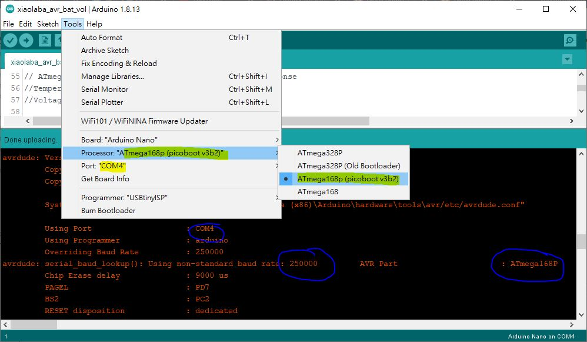

# AVR_Mega168p_picoboot_try
Arduino IDE and test this bootloader  
Arduino IDE 1.8.13  
hardware : Nano with Atmega168P, Arduino IDE has no support, perhaps clone but not offical release. Atmega168 has different signature but supported


### download and save the picoboot, no fork yet,
author's https://github.com/nerdralph/picoboot/tree/master/arduino

download [picobootArduino168v3b2.hex](https://github.com/nerdralph/picoboot/blob/master/arduino/picobootArduino168v3b2.hex)  
copy to C:\Program Files (x86)\Arduino\hardware\arduino\avr\bootloaders\atmega\  
in case donwload failed here is the local copy,  
  
```  
:1000000011241D9AFCE303D03197E9F7F9CF8A95C3  
:04001000F1F7089567  
:103F000024B621FE7CC0519AAA27BB27C4E631966D  
:103F1000489B04C0E1F7CA95D1F771C01196489B40  
:103F2000FDCFB695A795B695A795A695AB1FAA9573  
:103F3000C0ECDD2712E01883AC8328E1298350E12F  
:103F400055D09033E9F718E01983BC81B3951197E8  
:103F5000C895E9F741E13FD029835E8347D0092F17  
:103F6000A4E13FD0053521F433D0FC01EE0FFF1F53  
:103F7000063511F0013409F4BE830537E1F5AEE1F1  
:103F800030D0A4E92ED0ABE02CD0043679F41CD08C  
:103F90009634C9F41DD00C0141E01DD03296325048  
:103FA000C9F7329743E017D045E015D0043759F4EC  
:103FB0000BD0E1BDF2BDA591953411F4F89AA0B5EE  
:103FC00010D03A95B1F7BFCF11D002D0382F089555  
:103FD0000DD0892F0BC017B710FDFDCF47BFE89557  
:103FE0000895188115FFFDCFAE830895188117FF3E  
:103FF000FDCF9E810895013541F65E83D9835198A6  
:00000001FF  
```  


### make Arduino IDE to support this board and picoboot,

locate the boards.txt, usually here, C:\Program Files (x86)\Arduino\hardware\arduino\avr
copy the file to user folder, open the file, find the lines,
```
##############################################################  
  
nano.name=Arduino Nano  
  
nano.upload.tool=avrdude  
nano.upload.protocol=arduino  
  
nano.bootloader.tool=avrdude  
nano.bootloader.unlock_bits=0x3F  
nano.bootloader.lock_bits=0x0F  

nano.build.f_cpu=16000000L  
nano.build.board=AVR_NANO  
nano.build.core=arduino  
nano.build.variant=eightanaloginputs  
  
```  
   
under section above, add following lines, and save to the folder/file 

```
## Arduino Nano w/ ATmega168p_picoboot  
## -------------------------  
nano.menu.cpu.atmega168p_picoboot=ATmega168p (picoboot v3b2)  
  
nano.menu.cpu.atmega168p_picoboot.upload.maximum_size=16128  
nano.menu.cpu.atmega168p_picoboot.upload.maximum_data_size=1024  
nano.menu.cpu.atmega168p_picoboot.upload.speed=250000  
  
nano.menu.cpu.atmega168p_picoboot.bootloader.low_fuses=0xf7  
nano.menu.cpu.atmega168p_picoboot.bootloader.high_fuses=0xd6  
nano.menu.cpu.atmega168p_picoboot.bootloader.extended_fuses=0xFc  
nano.menu.cpu.atmega168p_picoboot.bootloader.file=atmega/picobootArduino168v3b2.hex  

nano.menu.cpu.atmega168p_picoboot.build.mcu=atmega168p  


```  
restart ARduino IDE, select board as created & seen,
  


### burn the picoboot
burn this bootloader to Nano (with Atmega168P) and try.  
115200 baud, ok  
230400 baud, NG  
250000 baud, ok  
ok


